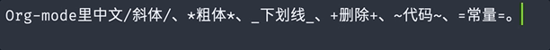

# separate-inline.el

自动插入分隔符

Separating word automatically with given regexp after newline behavior.



## Installation

Manually

1. git clone this reop and add to you load-path
2. Require this script
```elisp
(require 'separate-inline)
```
Then you can enable separate-inline-mode with `M-x separate-inline-mode` (But you should set [regexp-rule](https://github.com/ingtshan/separate-inline.el/blob/main/separate-inline.el#L9) before). 

Loading the mode in major-mode-hooks may also be useful. like:

```elisp
(add-hook 'org-mode-hook 'separate-inline-mode)

(add-hook 'org-mode-hook 
          '(lambda ()
            (add-hook 'separate-inline-mode-hook
                      'separate-inline-use-default-rules-for-org-local
                      nil 'make-it-local)))
```

With leaf and straight, like:

```elisp
(leaf separate-inline
  :ensure nil
  :straight (separate-inline 
             :type git :host github 
             :repo "ingtshan/separate-inline.el")
  :hook ((org-mode-hook . separate-inline-mode)
         (org-mode-hook
          .
          (lambda ()
            (add-hook 'separate-inline-mode-hook
                      'separate-inline-use-default-rules-for-org-local
                      nil 'make-it-local)))))
```
## An [tested example](https://github.com/ingtshan/separate-inline.el/blob/main/separate-inline.el#L84) of [regexp-rule](https://github.com/ingtshan/separate-inline.el/blob/main/separate-inline.el#L9)
```elisp
(defun separate-inline-use-default-rules-for-org-local ()
  "A tested rules for Chinese user to separate inline in org-mode.
org-mode 中文行内分隔规格"
  (make-local-variable 'separate-inline-regexp-rules)
  (setq separate-inline-regexp-rules
        '(("[\*\+\/\~\=\$\_]\\cc+[\*\+\/\~\=\$\_]"
           "\\cc" . "\x200B")
          ("[\*\+\/\~\=\$\_]*[0-9A-Za-z]+[\-0-9A-Za-z\*\+\/\~\=\$\_]*"
           "\\cc" . " "))))
```

